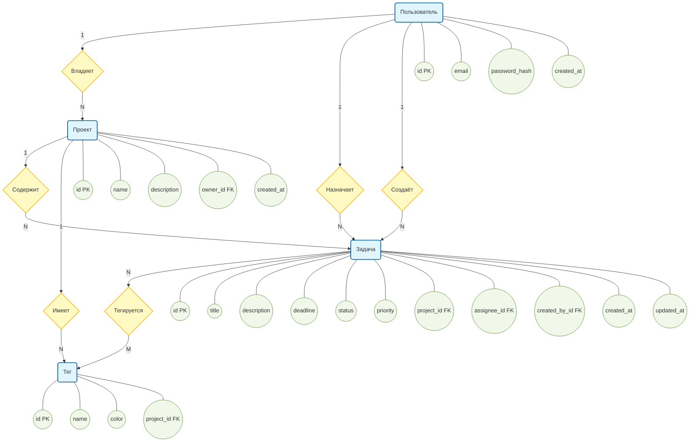

```mermaid
     graph TD
    classDef entity fill:#e1f5fe,stroke:#01579b,stroke-width:2px;
    classDef relation fill:#fff9c4,stroke:#fbc02d,stroke-width:2px;
    classDef attribute fill:#f1f8e9,stroke:#558b2f,stroke-width:1px,shape:ellipse;
    
    %% Сущности (прямоугольники)
    User(Пользователь):::entity
    Project(Проект):::entity
    Task(Задача):::entity
    Tag(Тег):::entity

    %% Связи (ромбы)
    owns{Владеет}:::relation
    contains{Содержит}:::relation
    has{Имеет}:::relation
    assigns{Назначает}:::relation
    creates{Создаёт}:::relation
    tags{Тегируется}:::relation

    %% Связи 1 ко многому
    User -- "1" --> owns
    owns -- "N" --> Project

    Project -- "1" --> contains
    contains -- "N" --> Task

    Project -- "1" --> has
    has -- "N" --> Tag

    User -- "1" --> assigns
    assigns -- "N" --> Task

    User -- "1" --> creates
    creates -- "N" --> Task

    Task -- "N" --> tags
    tags -- "M" --> Tag

    %% Атрибуты User (овалы)
    User --- U1((id PK)):::attribute
    User --- U2((email)):::attribute
    User --- U3((password_hash)):::attribute
    User --- U4((created_at)):::attribute

    %% Атрибуты Project
    Project --- P1((id PK)):::attribute
    Project --- P2((name)):::attribute
    Project --- P3((description)):::attribute
    Project --- P4((owner_id FK)):::attribute
    Project --- P5((created_at)):::attribute

    %% Атрибуты Task
    Task --- T1((id PK)):::attribute
    Task --- T2((title)):::attribute
    Task --- T3((description)):::attribute
    Task --- T4((deadline)):::attribute
    Task --- T5((status)):::attribute
    Task --- T6((priority)):::attribute
    Task --- T7((project_id FK)):::attribute
    Task --- T8((assignee_id FK)):::attribute
    Task --- T9((created_by_id FK)):::attribute
    Task --- T10((created_at)):::attribute
    Task --- T11((updated_at)):::attribute

    %% Атрибуты Tag
    Tag --- G1((id PK)):::attribute
    Tag --- G2((name)):::attribute
    Tag --- G3((color)):::attribute
    Tag --- G4((project_id FK)):::attribute
```
