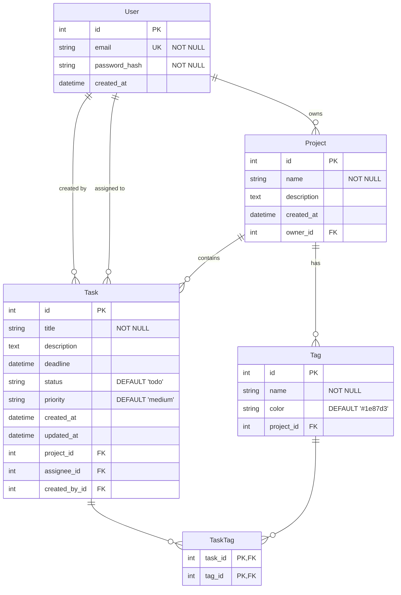

```mermaid
    erDiagram
    User ||--o{ Project : owns
    User ||--o{ Task : "created by"
    User ||--o{ Task : "assigned to"
    Project ||--o{ Task : contains
    Project ||--o{ Tag : has
    Task ||--o{ TaskTag : ""
    Tag ||--o{ TaskTag : ""
    
    User {
        int id PK
        string email UK "NOT NULL"
        string password_hash "NOT NULL"
        datetime created_at
    }
    
    Project {
        int id PK
        string name "NOT NULL"
        text description
        datetime created_at
        int owner_id FK
    }
    
    Task {
        int id PK
        string title "NOT NULL"
        text description
        datetime deadline
        string status "DEFAULT 'todo'"
        string priority "DEFAULT 'medium'"
        datetime created_at
        datetime updated_at
        int project_id FK
        int assignee_id FK
        int created_by_id FK
    }
    
    Tag {
        int id PK
        string name "NOT NULL"
        string color "DEFAULT '#1e87d3'"
        int project_id FK
    }
    
    TaskTag {
        int task_id PK, FK
        int tag_id PK, FK
    }
```
